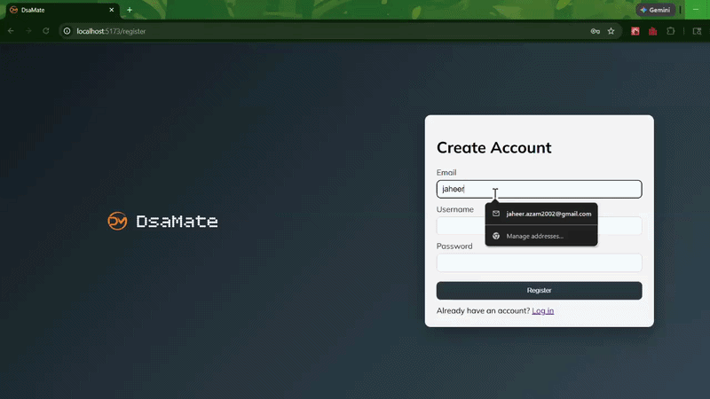
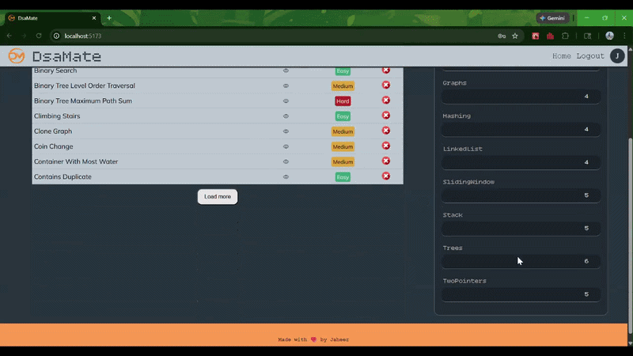
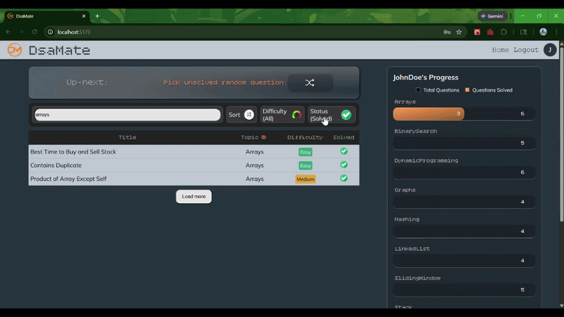

# DSAMate

DSAMate is a full-stack DSA practice tracker built for interview preparation.
It includes:

- **Frontend**: React + Vite app for authentication, filtering questions, and tracking solved progress.
- **Backend**: ASP.NET Core Web API with JWT auth, role-based access, EF Core, and SQL Server.

## Project Results

### Login Page

### Main Page

### Interactive Features
*Random, Load More & Reset Progress*  

## Project Structure

- `DSAMate.Web` → Frontend client (React)
- `DSAMate.API` → Backend API (.NET 8)
- `DSAMate.API.Tests` → Unit tests for backend services/controllers

## Read the Detailed Docs

- Frontend README: [`DSAMate.Web/README.md`](DSAMate.Web/README.md)
- Backend README: [`DSAMate.API/README.md`](DSAMate.API/README.md)
